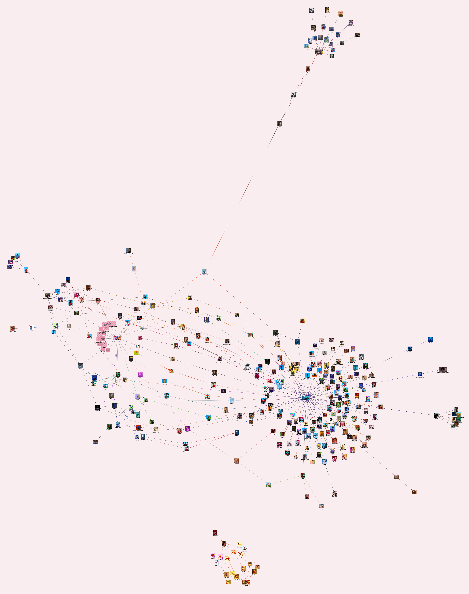

# Miraculous Ladybug Transformation Graph
Interactive network graph visualizing Miraculous Ladybug characters and their transformation relations.

## Working Demo
https://www.youtube.com/watch?v=gFL3eujjB3Q

## Try It Out
https://hyssopi.github.io/Miraculous-Ladybug-Transformation-Graph/

## References
- https://miraculousladybug.fandom.com/wiki/Kwamis
- https://miraculousladybug.fandom.com/wiki/Renlings
- https://miraculousladybug.fandom.com/wiki/Miraculous_holders
- https://miraculousladybug.fandom.com/wiki/Akumatized_villains
- https://miraculousladybug.fandom.com/wiki/United_Heroez
- https://miraculousladybug.fandom.com/wiki/Category:Characters
- https://miraculousladybug.fandom.com/wiki/Category:Character_designs

## Prerequisites
- (To build) `npm` installed.

## Build
Run `npm run webpack`.

## Run
Open `index.html` in a web browser.

## Test
(None)
